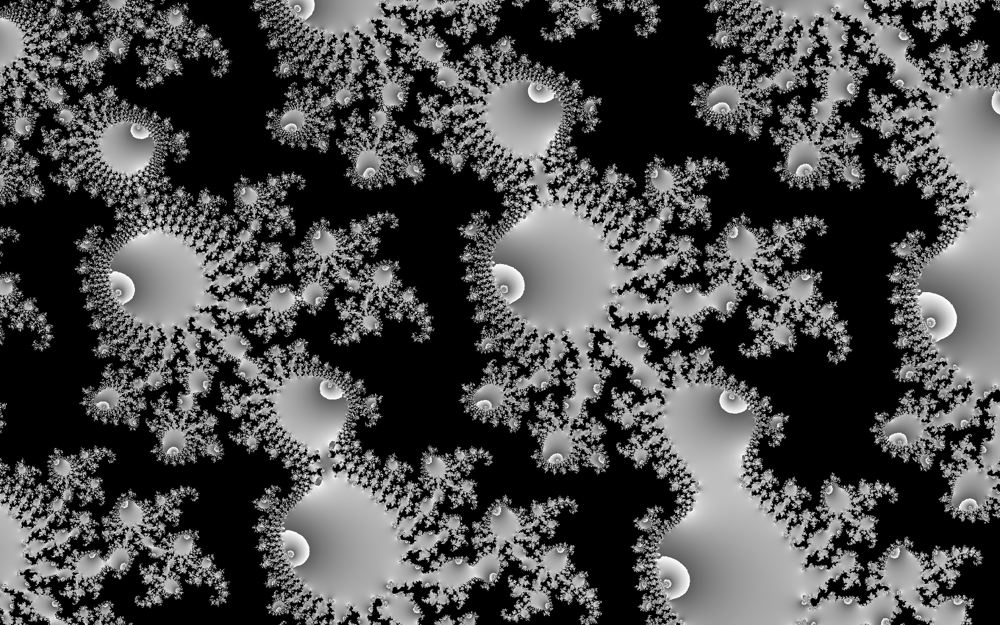
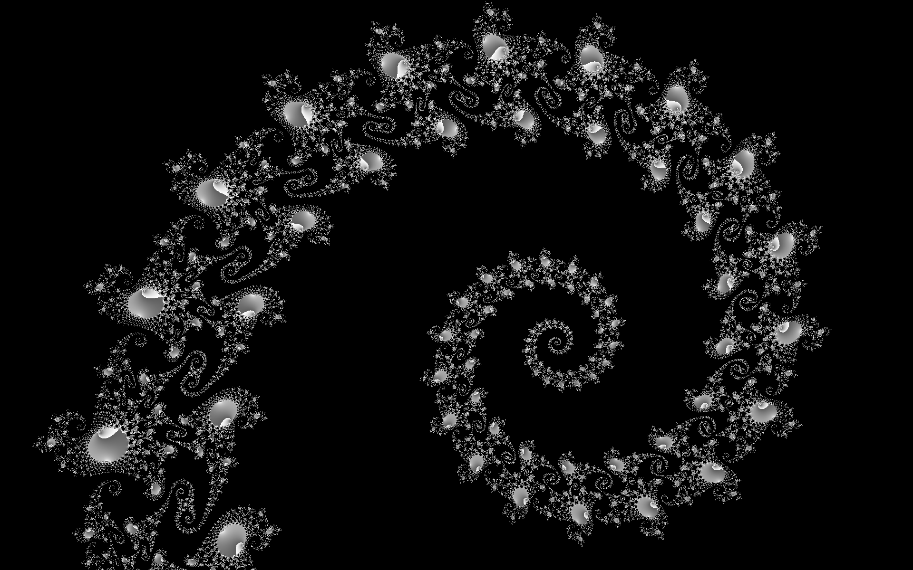
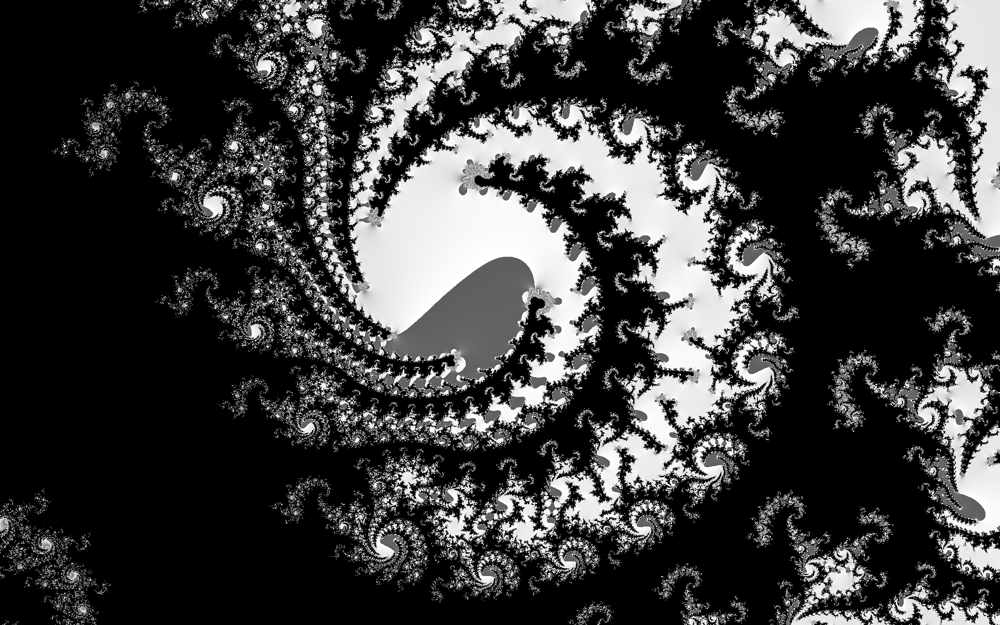
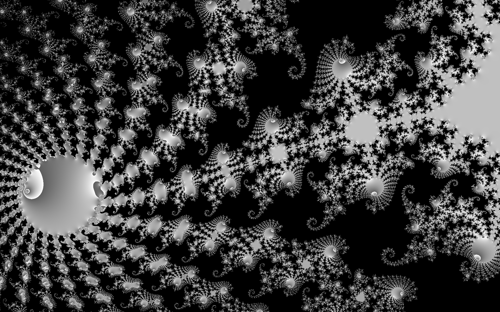

# OpenGL Mandelbrot
Displays an image of the Mandelbrot set rendered using OpenGL. Click and drag to move the image and scroll to adjust the zoom level. You can also move the camera using the arrow keys and adjust the zoom level with the 'Z' and 'X' keys.

Here are some screenshots taken from the program:

